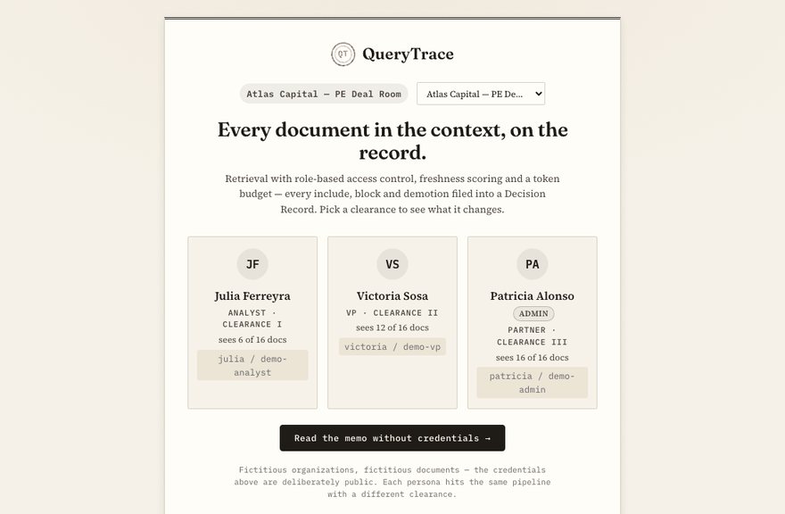
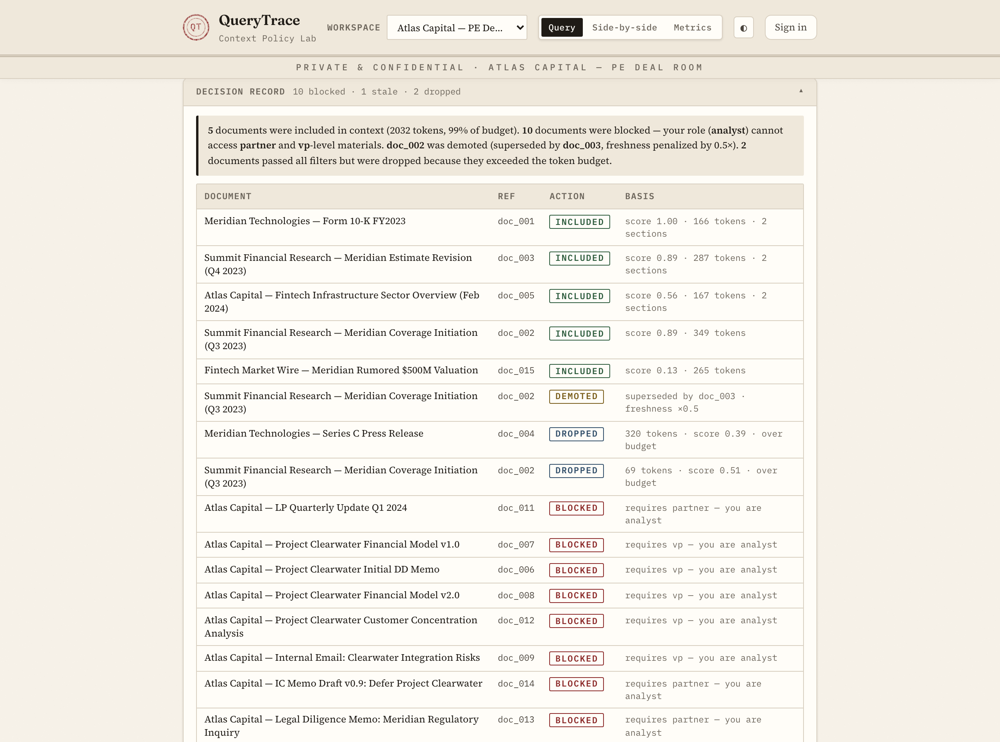
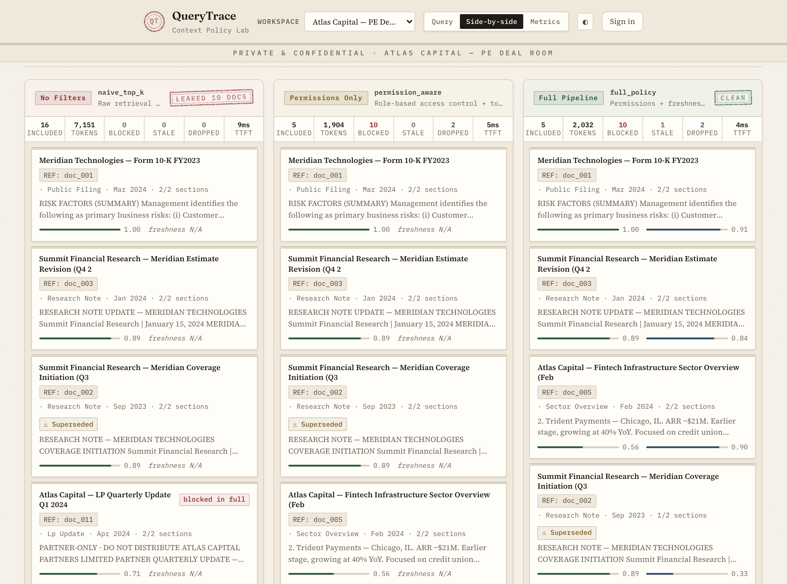
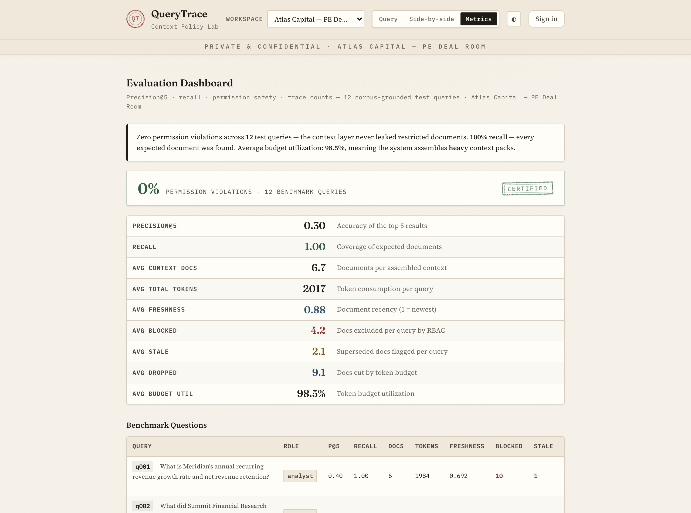
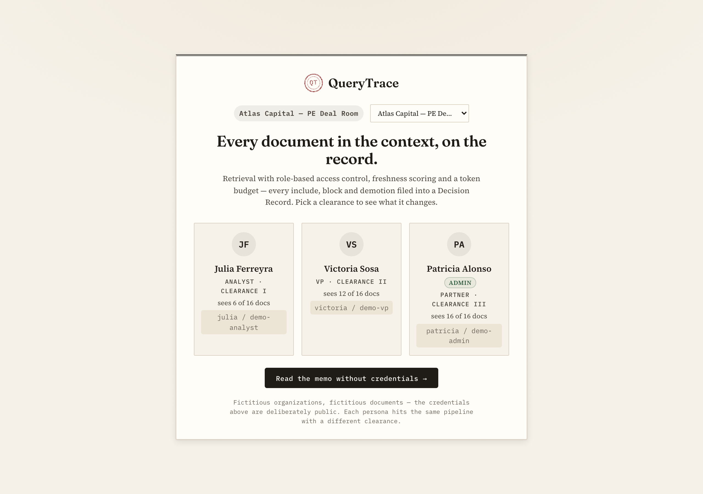
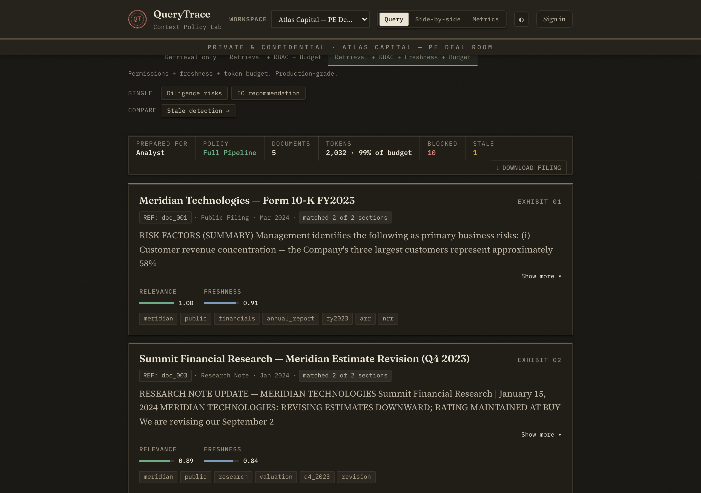
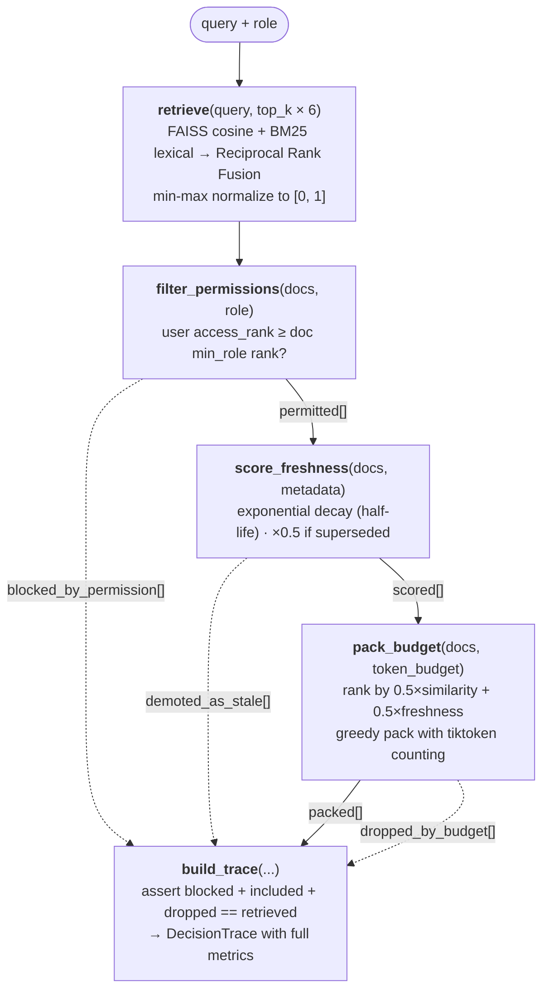

# QueryTrace

**A retrieval API that decides what an LLM is allowed to read — by role, by freshness, by token budget — and returns the receipt for every decision.**

> When an LLM asks for context, *what gets in — and what gets left out — is a policy decision.* QueryTrace makes every one of those decisions visible.

[](https://github.com/Julian0444/pacific-context-challenge/actions/workflows/ci.yml)

[](LICENSE)



Ask the same question as two different people and you get two different answers. Not because the model changed — because access control changed what it was allowed to read. On the built-in benchmarks, plain top-k retrieval leaks restricted documents on **half of all queries**. The full pipeline leaks **none**.

## The idea in 30 seconds

Most RAG demos stop at "embed, retrieve top-k, stuff the prompt." Production retrieval has three harder questions:

- Is this user **allowed** to see this document?
- Is this document **still current**, or has it been superseded?
- Does it **fit the budget** — and if not, what was cut?

QueryTrace answers them as explicit pipeline stages, and every response carries a **Decision Record** that accounts for each candidate it considered: included, blocked, demoted, or dropped. The invariant `blocked + included + dropped == retrieved` is asserted at runtime. Nothing disappears silently.

The demo ships a fictional private-equity deal room. **julia**, an analyst, asks about the acquisition's financial model and gets *"10 documents withheld · requires vp+"* — the withheld titles never even reach her browser. **victoria**, a VP, asks the same question and gets the real model, with the outdated v1 demoted below the current version. **patricia**, the admin, opens the audit log and finds julia's blocked attempt, attributed. Same code, same corpus, three different truths.

## What it looks like


*Every query returns a filing. The Decision Record lists each document, the action taken on it, and why.*


*The same query through three policies. The naive baseline gets stamped with how many restricted documents it leaked; the full pipeline earns its CLEAN stamp.*


*The 12-query benchmark as an annual report. The CERTIFIED plaque only renders when the violation rate is exactly zero.*

<p>
  
  
</p>

*Light and dark themes, WCAG AA contrast throughout. Vanilla HTML/CSS/JS — no framework, no build step.*

## Quickstart

```bash
python3 -m venv .venv && source .venv/bin/activate
pip install -r requirements.txt
python -m uvicorn src.main:app --reload   # → http://localhost:8000/app/
```

Or with Docker: `docker build -t querytrace . && docker run -p 8000:8000 querytrace`

Sign in as `julia / demo-analyst`, `victoria / demo-vp`, or `patricia / demo-admin` — fictitious organization, deliberately public credentials — or skip sign-in and explore the lab with any role and any policy. The guided tour, scenario by scenario, is in **[docs/demo-guide.md](docs/demo-guide.md)**.

One optional variable adds **Ask mode**: grounded answers over the governed context, with `[doc_id]` citations validated mechanically against what the model was actually shown.

```bash
export ANTHROPIC_API_KEY=sk-ant-...   # unset it and the feature disappears
```

## How it works



- Retrieval is hybrid: FAISS for meaning, BM25 for exact terms, fused with Reciprocal Rank Fusion over ~350-token chunks.
- Every stage is a pure function with typed inputs and a typed result. No I/O inside stages, no shared state.
- The pipeline over-retrieves 6×, because access control and the budget will thin the field before packing.
- Three presets make the controls comparable — the baseline exists to be beaten:

| Preset | RBAC | Freshness | Budget |
|---|:---:|:---:|:---:|
| `naive_top_k` | – | – | – |
| `permission_aware` | ✓ | – | ✓ |
| `full_policy` | ✓ | ✓ | ✓ |

Design notes for every stage and contract: **[docs/architecture.md](docs/architecture.md)**.

## The numbers

Each workspace ships a 12-query benchmark that runs through the production pipeline (`python -m src.evaluator --compare`). Measured results:

| | naive top-k | full pipeline |
|---|:---:|:---:|
| Permission violation rate — PE corpus | 50% | **0%** |
| Permission violation rate — SaaS corpus | 58% | **0%** |
| Recall (both corpora) | 1.00 | 1.00 |
| Avg context size per query | ~7,000 tokens | ~2,000 tokens |

Recall holds at 100% while the packed context shrinks by ~70% — what remains is what the role is allowed to spend tokens on. Ask mode has its own fidelity eval: citation validity, groundedness, and expected-document coverage all sit at 100% on the benchmark run. Full tables, the precision discussion, and the chunking study: **[docs/evaluation.md](docs/evaluation.md)**.

## What's in the box

- **Two isolated demo corpora** — a PE deal room and a SaaS internal knowledge base, each with its own documents, roles, personas, and benchmark. Nothing corpus-specific is hardcoded.
- **Bring your own corpus** — `python -m src.workspace create my-kb --from-dir ~/docs` turns any folder of PDFs and text files into a third workspace, through the same validation pipeline as an HTTP upload.
- **Sessions with server-side redaction** — sign in and your role comes from a signed cookie. Blocked documents leave the server as a count, never as titles; `curl` reveals nothing the UI hides.
- **Async ingestion, incremental indexing** — uploads return `202` with a job id and real progress states. Only the new document gets embedded: ~10 ms per add instead of a full rebuild.
- **A user-attributed audit log** — every query since server start: who ran it, and which documents were included, blocked, demoted, or dropped.
- **427 tests, 0 skipped** — CI needs no network and no API keys. The entire Ask surface runs against a mocked client, including the test that blocked documents can never reach the prompt.

## API

```
POST /query                    →  retrieval + Decision Record
POST /ask                      →  grounded answer + validated [doc_id] citations + trace
POST /compare                  →  same query through multiple policies side by side
GET  /workspaces               →  available workspaces
GET  /workspaces/{slug}/meta   →  roles, scenarios, personas for one workspace
GET  /evals?workspace=         →  12-query benchmark results
GET  /session-audit            →  live audit log
POST /ingest                   →  document upload → 202 + job_id (admin session)
GET  /ingest/jobs/{job_id}     →  ingest job progress
GET  /health                   →  status + feature flags
```

Interactive docs at `http://localhost:8000/docs` once the server is running.

## Stack

Python · FastAPI · Pydantic v2 · FAISS + BM25 with RRF · all-MiniLM-L6-v2 on ONNX Runtime (no PyTorch in the tree) · tiktoken · Claude for Ask mode (optional) · vanilla HTML/CSS/JS. Ships as a single service with a Dockerfile and `render.yaml` — it runs locally by design, but nothing about it is local-only.

## Limitations

Deliberate scope cuts, each with its upgrade path documented in [docs/architecture.md](docs/architecture.md#limitations--trade-offs):

- Demo-grade auth: signed-cookie sessions with public demo credentials. The upgrade path is OIDC.
- In-process job queue and caches — single-instance by design; the broker seam (`JobStore`) already exists.
- Chunk boundaries are paragraph-greedy, not semantic. A cross-encoder reranker is the declared next step.
- Prompt-injection hardening for uploaded documents is partial: tagged context blocks plus mechanical citation validation.

## More

- **[docs/architecture.md](docs/architecture.md)** — every stage, contract, and trade-off
- **[docs/evaluation.md](docs/evaluation.md)** — full benchmark tables and methodology
- **[docs/demo-guide.md](docs/demo-guide.md)** — the guided tour, credentials, and scenarios
- **[plansToPortfolio/](plansToPortfolio/)** — the build log, phase by phase

MIT licensed. All corpora are fictitious — no real companies, people, or data.
